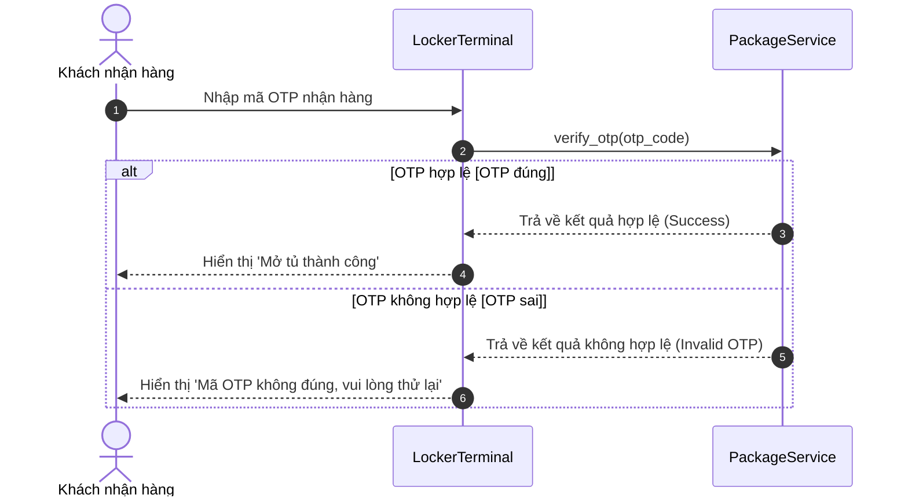

# BÁO CÁO PHÂN TÍCH THIẾU SÓT VÀ TỐI ƯU SƠ ĐỒ SEQUENCE DIAGRAM LUỒNG NHẬN HÀNG RIKKEI LOGISTICS SMART LOCKER

> 👤 **Học viên:** Đỗ Hoàng Sơn | **Mã SV:** PTIT-HCM-066
> 🏫 **Môn học:** IT105-K25-Phan-tich-thi-t-k-h-th-ng

---

## 📊 Sơ đồ thiết kế hệ thống (Sequence Diagram)

> 💡 *Sơ đồ dưới đây được render tự động trực tiếp trên GitHub bằng Mermaid. Bạn cũng có thể tải file **`bt4.drawio`** trong repository này để mở và chỉnh sửa trực tiếp trên [Draw.io (diagrams.net)](https://app.diagrams.net).* 

---

## Phần 1 - Xác định thiếu sót của sơ đồ Sequence Diagram hiện tại

Sau khi đối chiếu bản vẽ Sequence Diagram hiện tại với kịch bản nghiệp vụ nhận hàng tại tủ Rikkei Logistics Smart Locker, em nhận thấy sơ đồ ban đầu gặp thiếu sót nghiêm trọng khi chỉ mô tả luồng đơn lẻ (happy path) mà chưa tích hợp khối rẽ nhánh Combined Fragment (alt / else).

Sự thiếu sót này làm cho bản thiết kế không phản ánh đúng thực tế nghiệp vụ vì quy tắc xác thực OTP luôn tồn tại hai trường hợp riêng biệt mang tính loại trừ nhau:

- Thiếu nhánh xử lý ngoại lệ 'else' [OTP sai]: Khi khách hàng nhập sai OTP, 'PackageService' không có đường phản hồi kết quả không hợp lệ về cho 'LockerTerminal', dẫn đến việc 'LockerTerminal' không thể hiển thị câu thông báo lỗi 'Mã OTP không đúng, vui lòng thử lại'.
- Vi phạm chuẩn UML Sequence Diagram: Khối 'alt' (Alternatives) trong UML là cơ chế tiêu chuẩn để diễn tả điều kiện rẽ nhánh dựa trên kết quả của một phương thức. Việc không đưa khối 'alt / else' vào làm cho tài liệu kỹ thuật bị khuyết luồng, gây hiểu lầm cho đội ngũ lập trình viên (Developers) khi triển khai code thực tế.
- Rủi ro trải nghiệm người dùng (UX) và treo hệ thống: Nếu lập trình viên triển khai chính xác theo bản vẽ thiếu sót, hệ thống tại tủ LockerTerminal sẽ rơi vào trạng thái chờ phản hồi vĩnh viễn (timeout/hang) khi nhập sai OTP, gây ách tắc tại tủ nhận hàng.

## Phần 2 - Mô tả chi tiết luồng Sequence Diagram hoàn chỉnh

Để đảm bảo tính đúng đắn và bao quát 100% kịch bản nghiệp vụ theo yêu cầu đề bài, sơ đồ Sequence Diagram chuẩn hóa cần bổ sung khối Combined Fragment với toán tử 'alt' và nhánh 'else' bao bọc đúng phạm vi các thông điệp phản hồi từ PackageService tới LockerTerminal và từ LockerTerminal đến Khách nhận hàng.

Trình tự tương tác theo thứ tự thời gian được thiết kế chi tiết như sau:

- Bước 1: Khách nhận hàng thao tác trên màn hình cảm ứng của 'LockerTerminal' và nhập mã OTP.
- Bước 2: 'LockerTerminal' gửi thông điệp đồng bộ 'verify_otp(otp_code)' sang 'PackageService'.
- Nhánh alt [OTP đúng]: 'PackageService' trả về kết quả xác thực hợp lệ (Success). 'LockerTerminal' nhận phản hồi, bật chốt mở tủ và hiển thị thông báo 'Mở tủ thành công' cho khách hàng.
- Nhánh else [OTP sai]: 'PackageService' trả về kết quả không hợp lệ (Invalid OTP). 'LockerTerminal' nhận phản hồi và hiển thị thông báo lỗi 'Mã OTP không đúng, vui lòng thử lại' lên màn hình.

## Phần 3 - Bảng đặc tả thông điệp và tương tác luồng nhận hàng

Dưới đây là bảng đặc tả chi tiết các thông điệp (Messages) giao tiếp giữa các đối tượng trong sơ đồ Sequence Diagram TO-BE:

| STT | Đối tượng gửi | Đối tượng nhận | Tên thông điệp / Phương thức | Loại thông điệp | Điều kiện / Diễn giải |
| --- | --- | --- | --- | --- | --- |
| 1 | Khách nhận hàng | LockerTerminal | Nhập mã OTP nhận hàng | Synchronous Message | Thao tác trực tiếp trên giao diện màn hình tủ Locker |
| 2 | LockerTerminal | PackageService | verify_otp(otp_code) | Synchronous Call | Gửi yêu cầu đối soát OTP tới Service xử lý |
| 3a | PackageService | LockerTerminal | return valid_result | Reply Message | Thuộc nhánh alt [OTP đúng] - Trả về thành công |
| 3b | LockerTerminal | Khách nhận hàng | Mở tủ thành công | UI Signal | Thuộc nhánh alt [OTP đúng] - Kích hoạt khóa & Báo khách lấy hàng |
| 4a | PackageService | LockerTerminal | return invalid_result | Reply Message | Thuộc nhánh else [OTP sai] - Trả về thất bại |
| 4b | LockerTerminal | Khách nhận hàng | Báo 'Mã OTP không đúng, vui lòng thử lại' | UI Signal | Thuộc nhánh else [OTP sai] - Hiển thị cảnh báo để khách nhập lại |

## Phần 4 - Đánh giá tính sẵn sàng và xuất file nộp bài

Sơ đồ Sequence Diagram hoàn chỉnh đã được kiểm tra tính hợp lệ về cú pháp UML 2.0, bám sát các ràng buộc nghiệp vụ và phòng tránh hoàn toàn các bẫy dữ liệu (Edge Cases) đề bài đưa ra.

Toàn bộ dữ liệu thiết kế đã được cấu trúc hóa theo mã nguồn Mermaid và tọa độ khung nút trên Draw.io, sẵn sàng để nộp kèm file '.drawio' vào GitHub Organization 'IT105-K25-Phan-tich-thi-t-k-h-th-ng' đúng hạn.

---

## 📁 Danh sách tệp tin nộp bài trong Repository
- 📝 `bt4.docx`: Báo cáo tài liệu phân tích nghiệp vụ hoàn chỉnh.
- 🎨 `bt4.drawio`: File thiết kế sơ đồ chuẩn theo quy định đề bài (mở trực tiếp bằng [Draw.io](https://app.diagrams.net) hoặc Lucidchart).
